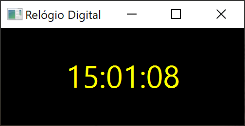

# Projeto Relógio Digital



## Description
Este projeto foi desenvolvido seguindo o curso: [Java 22: Aprenda POO + Componentes Gráficos + Projetos Incríveis para Iniciantes. Tudo ensinado com Amor!](https://www.udemy.com/share/10brPj3@WJAnjwgyy1RSox-juUhmtjHXWBFtEGYmRwkPG50QM_tUTyZbE_XxWbJTanuELq68/), do Professor Eng. Arnaldo Souza.

## Tools and Technologies
- Java v22;
- JavaFX;
- CSS

Classes Utilizadas:
- java.time.LocalDateTime --> Ex.: 2026-06-11T01:05:08
(ISO 8601)
- java.time.format.DateTimeFormatter --> Ex.: '11/06/2026
01:05'
- javafx.animation.Animation
- javafx.animation.Timeline
- javafx.animation.KeyFrame
- javafx.util.Duration
- javafx.application.Application;
- javafx.geometry.Pos;
- javafx.scene.Scene;
- javafx.scene.control.Label;
- javafx.scene.layout.VBox;
- javafx.stage.Stage;

## Como Correr o projeto

1- Faça clone deste repositório localmente:
```
    git clone https://github.com/thompsoncarlos/relogio-digital-java-udemy.git
```
2 - No terminal execute o comando para rodar projeto
```
    java --module-path "<SEU DIRETÓRIO JAVA>\Java>\javafx-sdk-22.0.1\lib" --add-modules javafx.controls ProjetoRelogioDigital
```


